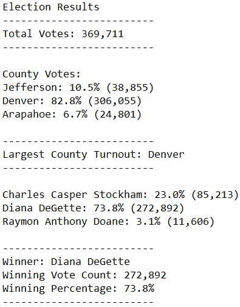

# Election_Analysis

## Project Overview
A member of the Colorado Board of Elections has asked for our assistance in conducting an audit of a recent congressional election in order to confirm the results. Using the raw data, we are tasked with:
1. Tallying the total number of votes cast
2. Compiling a list of the candidates and their respective vote counts and percentages
3. Determining the winner of the election
4. Tallying the voter turnout for each county
5. Calculating the percentage of total votes contributed by each county
6. Identifying the county with the highest turnout

## Resources
- Data Source: election_results.csv
- Software: Python 3.7.6, Visual Studio Code 1.53.2

## Results
Tha analysis of the data gave us the following results:
*	There was a total of 369,711 votes cast in the election
*	The breakdown by precinct was:
    * Jefferson County: 38,855 votes cast, 10.5% of total
    * Denver: 306,055 votes cast, 82.8% of total
    * Arapahoe: 24,801 votes cast, 6.7% of total
*	Denver County had the largest voter turnout
*	The vote distribution among the candidates was:
    * Charles Casper Stockham: 85,213 votes, 23.0%
    * Diana DeGette: 272,892 votes, 73.8% 
    * Raymon Anthony Doane: 11,606 votes, 3.1%
*	The winner of the popular vote is Diana DeGette.

The text file generated by running our code yields the following:

## Summary
The code we generated to calculate the results in this particular election can be used in other elections as well. Since we extract the county and candidate information, buidling a list of each as we iterate through the rows of data, the code will collect the data regardless the number of candidates and counties that are included in the raw data.

There are some cases in which the code would need to be modified:
- If the outcome was a tie there would need to be additional code added to ensure that both candidates names were listed.
- If the election was not a traditional election, for example if there are two open seats and the top two candidates are both winners, then the code could be refactored to take that into consideration.
