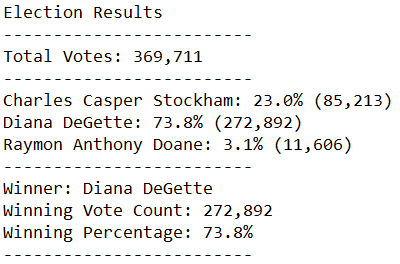

# Election_Analysis

## Project Overview
A memeber of the Colorado Board of Elections has asked for our assistance in conducting an audit of a recent congressional election. Using the raw data, we are tasked with:
1. Tallying the total number of votes cast
2. Compiling a list of the candidates and their respective vote counts and percentages
3. Determining the winner of the election

## Resources
- Data Source: election_results.csv
- Software: Python 3.7.6, Visual Studio Code 1.53.2

## Summary
Tha analysis of the data gave us the following results:

## Challenge Overview

## Challenge Summary
